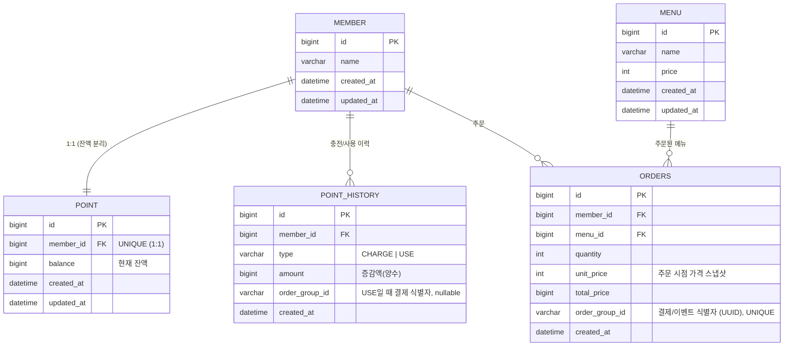

# ERD — 커피 주문 시스템

테이블 스키마의 전체 그림. 각 테이블 상세는 `docs/db/{테이블}.md`가 원천이다.

## 관계도

## 설계 의도 (요약, 상세는 ADR)

- **`POINT`를 `MEMBER`에서 1:1 분리** — 충전/차감 시 DB 락을 **잔액 행 하나로 좁히기** 위함. 회원 row 전체를 잠그지 않는다. → [ADR-004](../adr/ADR-004-데이터모델-포인트분리.md)
- **`POINT_HISTORY`는 append-only 감사 로그** — 잔액 계산의 원천이 아니다. 잔액의 원천은 `POINT.balance`.
- **`ORDERS.unit_price` 스냅샷** — 이후 메뉴 가격이 바뀌어도 과거 주문 금액은 불변.
- **`ORDER_ITEM` 테이블 없음** — 현재 주문 API는 메뉴 1건 단위. 결제 단위는 `order_group_id`(UUID)로 식별하며, 이 값이 **Kafka 이벤트 멱등 키**로도 쓰인다. → [ADR-002](../adr/ADR-002-주문이벤트-비동기전달.md) · [ADR-003](../adr/ADR-003-인기메뉴-집계전략.md)
- **인기 메뉴 카운트의 원천(SSOT)은 `ORDERS`** — Redis ZSET은 빠른 조회용 캐시. Redis 유실 시 `ORDERS`로 재구축 가능. → [ADR-003](../adr/ADR-003-인기메뉴-집계전략.md)

## 공통 규칙

- PK: `id BIGINT AUTO_INCREMENT`. FK: `{참조테이블}_id`.
- 시간: `created_at`/`updated_at` (`DATETIME`). 이력성 테이블(`POINT_HISTORY`, `ORDERS`)은 `created_at`만.
- 네이밍 snake_case, 테이블명 단수(`orders`는 예약어 회피 목적의 관용 복수).
